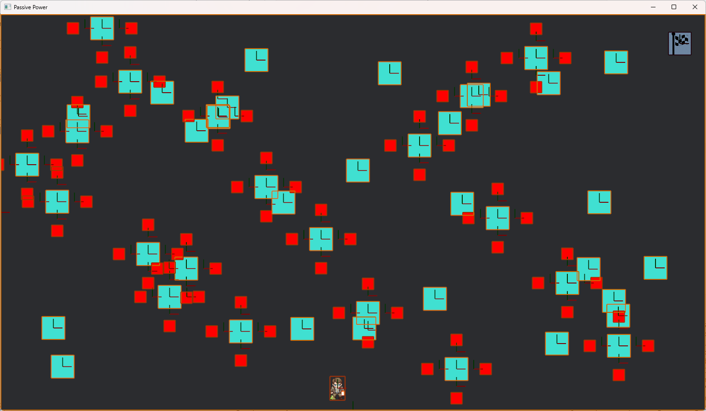

# Project name: Passive Power
# Name: Thanh Le Viet
## Project description
It is a game where a player need to get to the designated location (marked with a flag). The game has some basic controls (WASD) to explore the environment, background music settings. The character is animated in 4 directions. The obstacles that are generated randomly each time a game is started, and are meant to hold them off from reaching the flag.

## Project execution
- It is easily built with `cargo build --release`, or run with `cargo run`.
- `cargo test` can be executed beforehand to make sure everything is syntactically correct.
- First-time compilation will take a long time if the package are not already downloaded.
## Code illustration
    .
    ├── ...
    ├── game                    # game folder
    │   ├── assets              # game assets (logos, audios)
    │   └── src                 # source code
    │        ├── animator.rs    # sprite animation
    │        ├── audio.rs       # play sounds
    │        ├── consts.rs      # global constants
    │        ├── environment.rs # create objects in games
    │        ├── lib.rs         
    │        ├── main.rs        # control game flow
    │        ├── menu.rs        # menu design
    │        ├── player.rs      # movements and logics of player
    │        └── splash.rs      # bevy splashscreen
    ├── LICENSE
    └── README.md
## Things that work
- Game flow
- Game animation
- Audio player
- Collision detection
- Game state transitions
## Things that did not work as expected
- Game animation: The transitions between different animations are not smooth.
- Collision detection: The settings of physical environments are not flexible and easy to test.
- AI enemies: I orginally planned to write code that uses raycasting and AI to chase after a player but after getting into coding, I realized that would take an enormous amount of time to do.
- Multi-level: Designing a level takes a lot of time to make it challenging and interesting.

Overall, I'm happy with what I have achieved, it did take a lot of time to go through the Bevy documents and put everything together, once the code is compiled successfully, it almost guarantees that the game work seamlessly without a problem.

There are rooms for improvements and it can be easily done with a reasonable time frame for exploring and coding such as adding more sound effects, different kinds of obstacles, enemies, background effects (winds, limited vision, flashes...). More levels can be added, custom levels, time-constrained level, generally a GUI to help users create a level. 
